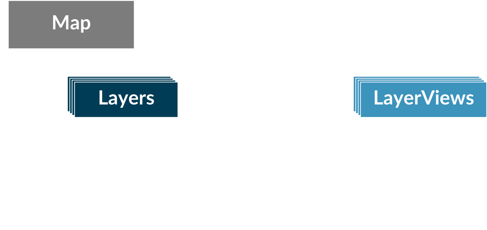
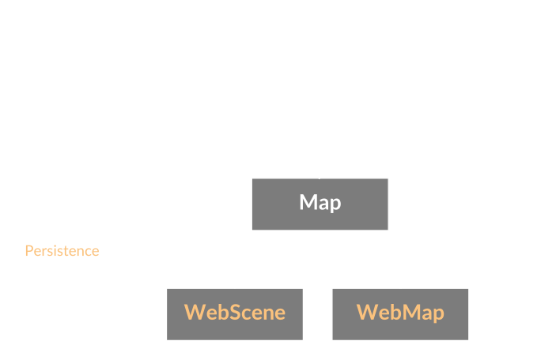

<!-- .slide: data-background="images/bg-1.png" -->

### Interactive 3D Maps with the<br/> ArcGIS API for JavaScript

### _Beyond the Basics_

<p style="font-size: 75%"><br/>
  Johannes Schmid, Esri R&amp;D Center Z&uuml;rich<br/>
  Stefan Eilemann, ESRI R&amp;D Center Z&uuml;rich
</p>
<p><br/><small>
Live version of this presentation:<br>https://esri.github.io/devsummit-2019-3D-jsapi/3d-maps-with-the-arcgis-js-api-beyond-the-basics
</small></p>

---

<!-- .slide: data-background="images/bg-2.png" -->

## Agenda

1. API Architecture
1. Working with SceneView
1. Interacting with Data
1. Feature Filtering
1. Symbology
1. Performance and Quality

---

<!-- .slide: data-background="images/bg-4.png" -->

## API Architecture

---

<!-- .slide: data-background="images/bg-2.png" -->

## API Architecture
### _Simple sample_

```javascript
require([
  "esri/Map",
  "esri/views/SceneView",
  "esri/views/FeatureLayer"
], function(Map, SceneView) {
  
  var map = new Map({
    basemap: "satellite"
  });
  
  var view = new SceneView({
    container: "viewDiv",
    map: map
  });
  
  var layer = new FeatureLayer({
    url: "http://..."
  });
  
  map.add(layer);
  
});
```

---

## API Architecture

<br/>


---

## API Architecture



---

### Properties
#### _Uniform access_

- Read/write all properties directly
- Initialize properties via constructor
- Automatic type conversion ("autocast")
- Watch for property changes instead of events

```javascript
var scene = new WebScene({
  // basemap is a property
  basemap: "satellite" 
});

scene.basemap = "streets";

scene.watch("basemap", (newValue) => { 
  console.log("Basemap has changed");
});
```

<span style="font-size: 50%">https://developers.arcgis.com/javascript/latest/api-reference/esri-WebScene.html#properties-summary</span>

---

<!-- .slide: data-background="images/bg-2.png" -->

### Promises

- Asynchronous operations return a `Promise`
- Example: [`geometryService.project()`](https://developers.arcgis.com/javascript/latest/api-reference/esri-tasks-GeometryService.html#project)
- `Promise` provides result and error callbacks

```js
var promise = geometryService.project(parameters);

promise
    .then((result) => {
      // process result
      view.graphics.add(new Graphic({
        geometry: result[0],
        symbol: { ... }
      }));
    })
    .catch((error) => {
      // handle error
      displayErrorMessage(error);
    });
```  

---

<!-- .slide: data-background="images/bg-2.png" -->

### Promises

- `Promise` is chainable and allows writing sequential asynchronous code
- Certain API classes behave like `Promise`, but using `when()`
  - [`SceneView`](https://developers.arcgis.com/javascript/latest/api-reference/esri-views-SceneView.html), [`MapView`](https://developers.arcgis.com/javascript/latest/api-reference/esri-views-MapView.html), [`Layer`](https://developers.arcgis.com/javascript/latest/api-reference/esri-layers-Layer.html)


```js
view
    .when(() => {
      // View is ready to be interacted with, load the layer
      return layer.load();
    })

    .then(() => {
      // Layer is now loaded, project extent using geometry service
      return geometryService.project([layer.fullExtent]);
    })

    .then((projected) => {
      // Extent has been projected, we can now go to it
      return view.goTo(projected[0]);
    })

    .then(() => {
      // Here the goTo animation has finished
    });
```

---

### LayerView
<ul>
  <li>`LayerView` are created automatically, but _asynchronously_</li>
  <li>Use [`view.whenLayerView()`](https://jscore.esri.com/javascript/latest/api-reference/esri-views-SceneView.html#whenLayerView) to obtain the LayerView for a layer
<pre><code class="lang-js hljs javascript">var layer = new FeatureLayer({ ... });
view.map.add(layer);

// API will now create LayerView (async)

view
  .whenLayerView(layer)
  .then((layerView) => {
    // do something with the LayerView
    layerView.filter = { ... };
  });
</code></pre> 
  </li>
  <li>There is also [`view.allLayerViews`](https://jscore.esri.com/javascript/latest/api-reference/esri-views-SceneView.html#allLayerViews), but beware async creation</li>
</ul>

---


<!-- .slide: data-background="images/bg-4.png" -->

## Working with SceneView

---


<!-- .slide: data-background="images/bg-2.png" -->

### SceneView

- The [`SceneView`](https://developers.arcgis.com/javascript/latest/api-reference/esri-views-SceneView.html) provides 3D specific functionality


```ts
class SceneView {
  // Camera specifies the view
  camera: Camera;

  // Programmatic navigation
  goTo(...);

  // Settings that affect constraints (e.g. navigation constraints)
  constraints: SceneViewConstraints;

  // Padding on the view
  padding: { top: number, right: number, bottom: number, left: number };

  // Quality profile
  qualityProfile: string;

  // Converting coordinate systems
  toScreen(mapPoint: Point): ScreenPoint;
  toMap(screenPoint: ScreenPoint): Point;
}
```

---


<!-- .slide: data-background="images/bg-2.png" -->

### Camera

- 3D viewing parameters in a [`SceneView`](https://developers.arcgis.com/javascript/latest/api-reference/esri-views-SceneView.html) are controlled by [`esri/Camera`](https://developers.arcgis.com/javascript/latest/api-reference/esri-Camera.html)

```ts
class Camera {
  // The position of the camera eye in 3D space (`x`, `y` + `z` elevation)
  position: Point;

  // The heading angle (towards north in degrees, [0, 360]°)
  heading: number;

  // The tilt angle ([0, 180]°, with 0° straight down, 90° horizontal)
  tilt: number;
}
```

---


<!-- .slide: data-background="images/bg-2.png" -->

### Camera

- Changing [`SceneView.camera`](https://developers.arcgis.com/javascript/latest/api-reference/esri-views-SceneView.html#camera) immediately updates the 3D view

<div class="twos">
  <div class="snippet">
  <pre><code class="lang-js hljs javascript">// Get a copy of the current camera
var camera = view.camera.clone();

// Increment the heading of the camera by 5 degrees
camera.heading += 5;

// Set the modified camera on the view
view.camera = camera;</code></pre>
  <div class="play-code" data-play-frame="frame-camera-heading-increment"></div>
  </div>
  <div class="snippet-preview">
    <iframe id="frame-camera-heading-increment" data-src="./snippets/setup-camera-heading-increment.html"></iframe>
  </div>
</div>

---


<!-- .slide: data-background="images/bg-3.png" -->

### goTo
<ul>
  <li>Simple, smooth navigation using [`SceneView.goTo(target, options)`](https://developers.arcgis.com/javascript/latest/api-reference/esri-views-SceneView.html#goTo)</li>
  <li class="fragment">Supports different targets:<br/> `Camera`, `Geometry`, `Geometry[]`, `Graphic`, `Graphic[]`</li>
  <li class="fragment">Specifying desired `scale`, `position`, `heading` and `tilt`</li>
  <li class="fragment">Specify animation options: `animate`, `speedFactor`, `duration`, `easing`</li>
  <li class="fragment">Returns a `Promise` which resolves when the animation has finished</li>
</ul>

---

<!-- .slide: data-background="images/bg-2.png" -->

### goTo

- Use [`SceneView.goTo()`](https://developers.arcgis.com/javascript/latest/api-reference/esri-views-SceneView.html#goTo) to create smooth camera animations

<div class="twos">
  <div class="snippet">
  <pre><code class="lang-js hljs javascript">
// compute new heading:
// current heading + 30 degrees
var heading = view.camera.heading + 30;

// go to with heading only preserves view.center
view.goTo({
  heading: heading
});
</code></pre>
  <div class="play-code" data-play-frame="frame-goto-heading"></div>
  </div>
  <div class="snippet-preview">
    <iframe id="frame-goto-heading" data-src="./snippets/setup-goto-heading.html"></iframe>
  </div>
</div>

---


<!-- .slide: data-background="images/bg-2.png" -->

### goTo

- Use [`SceneView.goTo()`](https://developers.arcgis.com/javascript/latest/api-reference/esri-views-SceneView.html#goTo) to frame a set of graphics

<div class="twos">
  <div class="snippet">
  <pre><code class="lang-js hljs javascript">// createGraphics() returns an array of Graphic
const graphics = createGraphics();
  
view.goTo({

  // The target is a set of graphics which should be
  // brought into view
  target: graphics

  // Additionally, define the scale, heading and tilt
  // of the desired view
  scale: 5000,
  heading: 30,
  tilt: 70
});
</code></pre>
  <div class="play-code" data-play-frame="frame-goto-graphics"></div>
  </div>
  <div class="snippet-preview">
    <iframe id="frame-goto-graphics" data-src="./snippets/setup-goto-graphics.html"></iframe>
  </div>
</div>

---


<!-- .slide: data-background="images/bg-2.png" -->

### goTo

- Use the options to control the animation

<div class="twos">
  <div>
    <div class="snippet">
      <pre><code class="lang-js hljs javascript">// double the animation speed
view.goTo(target, {
  speedFactor: 2
});
</code></pre>
      <div class="play-code" id="frame-goto-options-speed"></div>
    </div>
    <br/>
    <div class="snippet">
      <pre><code class="lang-js hljs javascript">// animate for exactly 1 second
view.goTo(target, {
  duration: 5000
});
</code></pre>
      <div class="play-code" id="frame-goto-options-duration"></div>
    </div>
    <br/>
    <div class="snippet">
      <pre><code class="lang-js hljs javascript">// disable easing
view.goTo(target, {
  easing: "linear"
});
</code></pre>
      <div class="play-code" id="frame-goto-options-easing"></div>
    </div>
  </div>  
  <div class="snippet-preview" style="width:60%">
    <iframe id="frame-goto-options" data-src="./snippets/setup-goto-options.html"></iframe>
  </div>
</div>

---


<!-- .slide: data-background="images/bg-2.png" -->

### View Constraints

- Use [`SceneView.constraints`](https://developers.arcgis.com/javascript/latest/api-reference/esri-views-SceneView.html#constraints) to control navigation and rendering aspects

<div class="twos">
  <div style="width:20%">
    <div class="snippet">
      <pre><code class="lang-js hljs javascript">// Set the allowed altitude range of the viewer
view.constraints.altitude = {
  max: 100000000, // 100'000 km
  min: 10000000   // 10'000 km
};
</code></pre>
    <div class="play-code" id="frame-constraints-altitude"></div>
    </div>
    <br/>
    <div class="snippet">
      <pre><code class="lang-js hljs javascript">// Set the clip distance (near/far planes)
// to override the default clipping heuristics
view.constraints.clipDistance = {
  far: 200000000, // 200'000 km
  near: 200000    // 200 km
};

</code></pre>
    <div class="play-code" id="frame-constraints-clipDistance"></div>
    </div>
  </div>
  <div class="snippet-preview">
    <iframe id="frame-constraints" data-src="./snippets/setup-constraints.html"></iframe>
  </div>
</div>

<p style="text-align: center; font-size: 0.5em">Original satellite app: https://github.com/richiecarmichael/Esri-Satellite-Map</span>
</p>

---

<!-- .slide: data-background="images/bg-2.png" -->

### View Padding

- Use [`SceneView.padding`](https://developers.arcgis.com/javascript/latest/api-reference/esri-views-SceneView.html#constraints) to focus view on a rectangle

<div class="twos">
  <div class="snippet">
  <pre><code class="lang-js hljs javascript">// Set the padding to make
// space for a sidebar and a header
view.padding = {
  top: 50,
  left: 150
};
</code></pre>
  <div class="play-code" data-play-frame="frame-padding"></div>
  </div>
  <div class="snippet-preview">
    <iframe id="frame-padding" data-src="./snippets/setup-padding.html"></iframe>
  </div>
</div>

---

<!-- .slide: data-background="images/bg-2.png" -->

### Background

<div class="twos">
  <div class="snippet">
  <pre><code class="lang-js hljs javascript">var view = new SceneView({
  container: viewDiv,
  map: map,

  // enable canvas transparency
  alphaCompositingEnabled: true,
  
  environment: {
    // set transparent background
    background: {
      type: "color",
      color: [0, 0, 0, 0]
    },
    
    // disable stars & atmosphere
    starsEnabled: false,
    atmosphereEnabled: false
  },
  
  // don't create any default widgets
  ui: null
});
</code></pre>
  </div>
  <div class="snippet-preview">
    <iframe id="frame-background" data-src="./snippets/setup-background.html" style="background-image: none; background-color: rgba(0, 0, 0, 0); border: 2px solid rgba(0, 0, 0, 0.3)"></iframe>
  </div>
</div>

<span style="font-size: 50%">https://ralucanicola.github.io/JSAPI_demos/cities-globe/</span>

---

<!-- .slide: data-background="images/bg-2.png" -->

### Overview Map

<div class="snippet-preview">
  <iframe data-src="./snippets/overview-map.html" style="width: 1000px; height: 600px"></iframe>
</div>

---

<!-- .slide: data-background="images/bg-4.png" -->

## Interacting with Data

---

<!-- .slide: data-background="images/bg-2.png" -->

### Mouse Interaction
#### _View.toMap_

- `toMap` translates screen (mouse) point to map coordinates

<div class="twos">
  <div class="snippet">
  <pre><code class="lang-js hljs javascript">document.getElementById("viewDiv").onclick =
function (event) {
  event.stopPropagation();

  // get mouse position in map coordinates
  var point = view.toMap(event);
  polygon = addPointToPolygon(point);
  view.graphics.push(polygon); // add to view
}
</code></pre>
  <div class="play-code" data-play-frame="frame-tomap-graphics"></div>
  </div>
  <div class="snippet-preview">
    <iframe id="frame-tomap-graphics" data-src="./snippets/tomap-graphics.html"></iframe>
  </div>
</div>

---

<!-- .slide: data-background="images/bg-2.png" -->

### Mouse Interaction
#### _View.hitTest_

- `hitTest` intersects scene and delivers hit objects

<div class="twos">
  <div class="snippet">
  <pre><code class="lang-js hljs javascript" style="font-size: 85%">document.getElementById("viewDiv").onclick = function (event) {
  event.stopPropagation();

  view.hitTest({x: event.clientX, y: event.clientY})
  .then(function (response) {
    // check only front-most hit
    var result = response.results[0];
    // Use it if it is a graphic
    if (result && result.graphic) {
      var point = result.graphic.geometry;
      polygon = addPointToPolygon(point);
      view.graphics.push(polygon); // add to view
    }
  }
}
</code></pre>
  <div class="play-code" data-play-frame="frame-hittest-graphics"></div>
  </div>
  <div class="snippet-preview">
    <iframe id="frame-hittest-graphics" data-src="./snippets/hittest-graphics.html"></iframe>
  </div>
</div>


---

<!-- .slide: data-background="images/bg-2.png" -->

### Mouse Interaction
#### _View.hitTest_

- 4.11: `hitTest` delivers multiple hits

<div class="twos">
  <div class="snippet">
  <pre><code class="lang-js hljs javascript">view.hitTest({...})
.then(function (response) {
  // for each hit...
  for (result of response.results){
    // ... add sphere graphic
    layer.graphics.push(
      new Graphic({... result.mapPoint});
  }

  // add line from first to last hit
  var line = new Polyline({
    paths:[first point, last point], 
  });

  layer.graphics.push(new Graphic({... line});
}
</code></pre>
  </div>
  <div class="snippet-preview">
    <iframe id="frame-hittest-graphics" data-src="./snippets/hittest-scene.html"></iframe>
  </div>
</div>

---

<!-- .slide: data-background="images/bg-2.png" -->

### Mouse Interaction

|               toMap               |              hitTest               |
| :-------------------------------: | :--------------------------------: |
|   first hit in map coordinates    |    multiple hits with the scene    |
| only intersects ground by default | only intersects  layers by default |
<td colspan=2> Use include: or exclude: options to override defaults 

---


<!-- .slide: data-background="images/bg-2.png" -->

### Mouse Interaction
#### _SketchViewModel_

- High-Level Widget for drawing

<div class="twos">
  <div class="snippet">
  <pre><code class="lang-js hljs javascript">var graphicsLayer = new GraphicsLayer();
var map = new Map({
  layers: [graphicsLayer]
}),

view.when(function () {
  var svm = new SketchViewModel({
    layer: graphicsLayer,
    view: view
  });
  svm.create("polygon");
});
</code></pre>
  <div class="play-code" data-play-frame="frame-svm-graphics"></div>
  </div>
  <div class="snippet-preview">
    <iframe id="frame-svm-graphics" data-src="./snippets/svm-graphics.html"></iframe>
  </div>
</div>

---

### Slice Widget

<div class="twos">
  <div>
    <div class="snippet">
    <pre><code class="lang-js hljs javascript">const buildingLayer = new BuildingSceneLayer({
  portalItem: {
    id: "fca0557a79c645e6843b00a7b55ce511"
  }
});
view.map.layers.add(buildingLayer);

// Create slice widget
var sliceWidget = new Slice({
  view: view
});

// Add widget to the UI
view.ui.add(sliceWidget, "top-right");
</code></pre>
    </div>
    <br/>
    <div class="snippet fragment">
    <pre><code class="lang-js hljs javascript">// Create measurement widget
var msmtWidget = new DirectLineMeasurement3D({
  view: view
});

// Add widget to the UI
view.ui.add(msmtWidget, "top-right");
</code></pre>
      <div class="play-code" data-play-frame="widgets-slice"></div>
    </div>
  </div>
  <div class="snippet-preview" style="width:100%">
    <iframe id="widgets-slice" data-src="./snippets/widgets-slice.html"></iframe>
  </div>
</div>

---

<!-- .slide: data-background="images/bg-4.png" -->

## Feature Filtering

- Model - View
- Layer - LayerView
- Layer filters are applied during data fetch
- LayerView filters are client side

---

<!-- .slide: data-background="images/bg-2.png" -->

### Server-Side Filtering
#### _DefinitionExpression_

- Applied when fetching data

<div class="twos">
  <div class="snippet">
  <pre><code class="lang-js hljs javascript">var layer = new FeatureLayer(...);

// only show healthy trees
layer.definitionExpression = "health = 'good'"
</code></pre>
  <div class="play-code" data-play-frame="frame-def-graphics"></div>
  </div>
  <div class="snippet-preview">
    <iframe id="frame-def-graphics" data-src="./snippets/def-graphics.html"></iframe>
  </div>
</div>

---

<!-- .slide: data-background="images/bg-2.png" -->

### Client-Side Filtering
#### _Spatial Filter_

- FeatureFilter on FeatureLayerView and SceneLayerView
  
<div class="twos">
  <div class="snippet">
  <pre><code class="lang-js hljs javascript">view.when(function () {
  // Create SketchViewModel to draw filter
  var svm = new SketchViewModel({
    layer: graphicsLayer,
    view: view
  });
  svm.create("polygon");

  // SVM finished filter
  graphicsLayer.graphics.on("change", () => {

    // apply geometry as contains filter:
    const graphic = graphicsLayer.graphics.getItemAt(0);
    layerView.filter = new FeatureFilter({
      geometry: graphic.geometry.clone(),
      spatialRelationship: "contains"
    });
  });
});
</code></pre>
  <div class="play-code" data-play-frame="frame-filter-graphics"></div>
  </div>
  <div class="snippet-preview">
    <iframe id="frame-filter-graphics" data-src="./snippets/filter-graphics.html"></iframe>
  </div>
</div>


---

<!-- .slide: data-background="images/bg-4.png" -->

## Symbology

---

<!-- .slide: data-background="images/bg-2.png" -->

### Symbology

- Set up two areas for different Styles

<div class="twos">
  <div class="snippet">
  <pre><code class="lang-js hljs javascript">
var map = new Map({
  layers: [inside, outside]
}),

var mask = new Polygon({...});

// Layer showing features inside of mask:
view.whenLayerView(inside).then(function (lv) {
  lv.filter = new FeatureFilter({
    geometry: mask,
    spatialRelationship: "intersects"
  });
});

// Layer showing features outside of mask:
view.whenLayerView(outside).then(function (lv) {
  lv.filter = new FeatureFilter({
    geometry: mask,
    spatialRelationship: "disjoint"
  });
});
</code></pre>
  <div class="play-code" data-play-frame="frame-filter-inout"></div>
  </div>
  <div class="snippet-preview">
    <iframe id="frame-filter-inout" data-src="./snippets/inout-graphics.html"></iframe>
  </div>
</div>

---

<!-- .slide: data-background="images/bg-2.png" -->

### Symbology
#### _Outside_

<div class="twos">
  <div class="snippet">
  <pre><code class="lang-js hljs javascript">// Declutter and improve perspective
outside.screenSizePerspectiveEnabled = true;
outside.featureReduction = {
  type: "selection"
};

// use 2D tree symbol
outside.renderer = new SimpleRenderer({
  symbol: new PointSymbol3D({
    symbolLayers: [
      new IconSymbol3DLayer({
        resource: { href: "..." },
        size: 12,
        material: { color: "darkgreen" }
    })],
    verticalOffset: {
      screenLength: 6
    },
  })
});)
</code></pre>
  <div class="play-code" data-play-frame="frame-filter-outside"></div>
  </div>
  <div class="snippet-preview">
    <iframe id="frame-filter-outside" data-src="./snippets/outside-graphics.html"></iframe>
  </div>
</div>

---

<!-- .slide: data-background="images/bg-2.png" -->

### Symbology
#### _Inside_

<div class="twos">
  <div class="snippet">
  <pre><code class="lang-js hljs javascript">// select unique symbols by species
inside.renderer = new UniqueValueRenderer({
  field: "spc_common",
  defaultSymbol: new WebStyleSymbol({
    name: "Alnus",
    styleName: "EsriThematicTreesStyle"
  })
});

// species lookup table
var trees = [ ["black locust", "Robinia"],  ... ];

// Use WebStyleSymbol to map species to model
for (var i = 0; i < trees.length; ++i) {
  var id = trees[i][0];
  var name = trees[i][1];
  inside.renderer.addUniqueValueInfo(id, 
    new WebStyleSymbol({
      name: name,
      styleName: "EsriRealisticTreesStyle"
    }));
}
</code></pre>
  <div class="play-code" data-play-frame="frame-filter-inside"></div>
  </div>
  <div class="snippet-preview">
    <iframe id="frame-filter-inside" data-src="./snippets/inside-graphics.html"></iframe>
  </div>
</div>

---

<!-- .slide: data-background="images/bg-4.png" -->

## Performance and Quality

---

<!-- .slide: data-background="images/bg-2.png" -->

### View Quality

- Use [`qualityProfile`](https://developers.arcgis.com/javascript/latest/api-reference/esri-views-SceneView.html#constraints) and [`quality`](https://developers.arcgis.com/javascript/latest/api-reference/esri-views-SceneView.html#constraints) to control performance and quality
- Affects
  - Level of detail for tile and scene layer
  - Anti-aliasing
  - Memory limit

---

<!-- .slide: data-background="images/bg-2.png" -->

### View Quality

<div class="twos">
  <div class="snippet">
  <pre><code class="lang-js hljs javascript" style="padding: 0 24px 0 24px">
viewLeft = new SceneView({
  qualityProfile: "low",

  environment: {
    atmosphere: { quality: "low" },
    lighting: {
      directShadowsEnabled: false,
      ambientOcclusionEnabled: false
    }
  }
});

viewRight = new SceneView({
  qualityProfile: "high"

  environment: {
    atmosphere: { quality: "high" }
    lighting: {
      directShadowsEnabled: true,
      ambientOcclusionEnabled: true
    }
  }
});
</code></pre>
  <div class="play-code" data-play-frame="frame-quality-profile"></div>
  </div>
  <div class="snippet-preview">
    <iframe id="frame-quality-profile" data-src="./snippets/setup-quality-profile.html"></iframe>
  </div>
</div>


---

<!-- .slide: data-background="images/bg-2.png" -->

### Memory and Quality

- Reduce number of layers
  - In particular Map Tile Layers
  - Combine Data into a single Layer
- Textured SceneLayers use more than non-textured
- Edges
- Graphics
- API will reduce quality under Memory Pressure

---

<!-- .slide: data-background="images/bg-2.png" -->

### Memory and Quality

<div class="twos">
  <div style="width:11%">
    <div class="snippet">
  <pre><code class="lang-js hljs javascript">// Use simpler basemap
view.map.basemap = "topo";
</code></pre>
  <div class="play-code" id="frame-memory1"></div>
  </div><div class="snippet">
<pre><code class="lang-js hljs javascript">// Reduce number of trees
treeLV.maximumNumberOfFeatures = 10000;
</code></pre>
  <div class="play-code" id="frame-memory2"></div>
  </div><div class="snippet">
<pre><code class="lang-js hljs javascript">// Use simpler basemap
buildings.renderer = {
  ..no edges.. 
};
</code></pre>
  <div class="play-code" id="frame-memory3"></div>
  </div>
  </div>
  <div class="snippet-preview">
    <iframe id="frame-memory" data-src="./snippets/memory.html"></iframe>
  </div>
</div>

---

<!-- .slide: data-background="images/bg-2.png" -->

### Data Preparation

- Publish in Scene SpatialReference to avoid reprojection
- In ArcGIS Online Layer Item Settings:
  - Tick the checkbox for Optimize Layer Drawings
  - Rebuild Spatial Index
  - Set the Cache Control to 1 hour

---

<!-- .slide: data-background="images/bg-2.png" -->

## External renderer

- You have data that you cannot visualize with available layers and renderers
- You want visualizations/animations that are not (yet) available
- You are familiar with WebGL and can afford the development effort


---

<!-- .slide: data-background="images/bg-2.png" -->

## External renderer

<video controls>
  <source src="images/hurricane.mp4" type="video/mp4">
</video>

---

<!-- .slide: data-background="images/bg-2.png" -->

### Related sessions
<br/>
Advanced WebGL in 3D Scene Views with the ArcGIS API for JavaScript<br/>
_Thu 1.30pm, Demo Theater 1 (Oasis 1-2)_<br/>
<br/> 
Practical Guide for Building a 3D Web App From 2D Data<br/>
_Thu 10.30am, Primrose A_<br/>
<br/>
3D Visualization with the ArcGIS API for JavaScript<br/>
_Thu 4pm, Primrose C-D_<br/>

---

<!-- .slide: data-background="images/bg-survey.jpg" -->

---

<!-- .slide: data-background="images/bg-esri.png" -->
