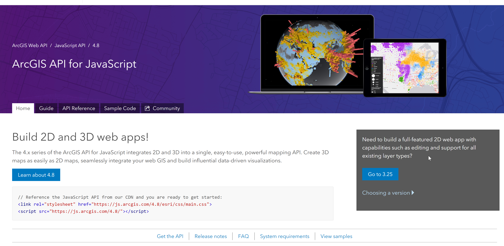

<!-- .slide: data-background="../images/bg-1.png" -->

### Interactive 3D Maps with the<br/> ArcGIS API for JavaScript

### _Getting Started_
<p style="font-size: 75%"><br/>
  Johannes Schmid, Esri R&amp;D Center Z&uuml;rich<br/>
  Arno Fiva, Esri R&amp;D Center Z&uuml;rich
</p>
<p><br/><small>
Live version of this presentation:<br>https://esri.github.io/devsummit-2019-3D-jsapi/3d-maps-with-the-arcgis-js-api-getting-started
</small></p>

---

<!-- .slide: data-background="../images/bg-4.png" -->


---

<!-- .slide: data-background="../images/bg-2.png" -->

## Preface

- This session is about writing JavaScript & HTML!
- Esri provides configurable applications
  - [SceneViewer](https://www.esri.com/en-us/arcgis/products/3d-scene-viewer)
  - [Story Maps](https://storymaps.arcgis.com/en/)
  - [Web AppBuilder](https://www.esri.com/en-us/arcgis/products/web-appbuilder/overview)

---

<!-- .slide: data-background="../images/bg-2.png" -->

## Preface

Browser requirements
- Any _modern_ browser will work (IE 11+)
- Mobile: _latest_ Samsung & Apple devices
- Desktop: dedicated graphics card recommended

---

<!-- .slide: data-background="../images/bg-2.png" -->

## Agenda

1. Getting Started
2. Adding Data
3. Visualizing Data
4. Interacting with Data
5. Web Scenes

---

<!-- .slide: data-background="../images/bg-4.png" -->

## Getting Started

---

<!-- .slide: data-background="../images/bg-3.png" -->

### The simplest possible app

<span style="font-size: 50%">https://developers.arcgis.com/javascript/latest/sample-code/sandbox/index.html?sample=intro-sceneview</span>

<div style="max-width: 900px; float: none; position: absolute; left: 50%; transform: translate(-50%, 0); font-size: 31px;">

```html
<!DOCTYPE html>
<html>
<head>
  <meta charset="utf-8">
  <title>Create a 3D map</title>  

  <link rel="stylesheet" href="//js.arcgis.com/4.10/esri/css/main.css">
  <script src="//js.arcgis.com/4.10/"></script>  

</head>
<body>
  <script>
      require([
        "esri/Map",
        "esri/views/SceneView",
        "dojo/domReady!"
      ], function(Map, SceneView) {

        var map = new Map({
          basemap: "satellite"
        });

        var view = new SceneView({
          container: "viewDiv",
          map: map
        });        
      });
  </script>
  <div id="viewDiv"></div>
</body>
</html>
```


---

### The simplest possible app

- Out of the box you get:
  - 3D rendering of the world
  - User interaction with the 3D view (navigation)
  - A set of basemaps to work with
  - 3D terrain

---

<!-- .slide: data-background="../images/bg-3.png" -->

### Architecture

<br/>


---

<!-- .slide: data-background="../images/bg-3.png" -->

### Changing a map from 2D to 3D

- [`Map`](https://developers.arcgis.com/javascript/latest/api-reference/esri-Map.html) is universal
- [`MapView`](https://developers.arcgis.com/javascript/latest/api-reference/esri-MapView.html) creates a 2D map
- [`SceneView`](https://developers.arcgis.com/javascript/latest/api-reference/esri-SceneView.html) creates a 3D map

<span style="font-size: 50%">https://developers.arcgis.com/javascript/latest/sample-code/sandbox/index.html?sample=layers-vectortilelayer</span>

---

<!-- .slide: data-background="../images/bg-4.png" -->

## Resources

---

<!-- .slide: data-background="../images/bg-3.png" -->
### <b>ArcGIS API for JavaScript</b>

<span style="font-size: 50%">https://developers.arcgis.com/javascript/</span>



<p class="fragment" data-fragment-index="2"
  style="position: absolute; top:120px; max-width: 1200px; left: 50%; transform: translate(-50%, 0); width: 1100px">
  
</p>

---

<!-- .slide: data-background="../images/bg-3.png" -->
### <b>ArcGIS API for JavaScript Sandbox</b>

<span style="font-size: 50%">https://developers.arcgis.com/javascript/latest/sample-code/</span>


---

<!-- .slide: data-background="../images/bg-3.png" -->
### <b>GitHub</b>

<span style="font-size: 50%">https://github.com/esri</span>


---

<!-- .slide: data-background="../images/bg-4.png" -->

## Adding Data

---

<!-- .slide: data-background="../images/bg-3.png" data-title="add-tile-layer" -->

### Add TileLayer

<div class="two-columns">
  <div class="left-column">

<div class="code-snippet" style="font-size: 160%;">
<button class="play" id="addTileLayerButton"></button>
<pre><code class="lang-ts">// Add layer showing housing density in NYC
var housingDensityLayer = new TileLayer({
  url: "//tiles.arcgis.com/.../NY_Housing..."
});
map.layers.add(housingDensityLayer);
</code></pre>
</div>

<div class="code-snippet" style="font-size: 160%;">
<button class="play" id="addPortalTileLayerButton"></button>
<pre><code class="lang-ts">// Add layer using as portal item
var housingDensityLayer = new TileLayer({
  portalItem: {
    id: "2d6f6624424a410a994bd9432befb907"
  }
});
map.layers.add(housingDensityLayer);
</code></pre>
</div>

  </div>
  <div class="right-column">
    <iframe id="go-to-demo" data-src="./samples/newyork-getting-started.html" ></iframe>
  </div>
</div>

---

<!-- .slide: data-background="../images/bg-3.png" data-title="add-feature-layer" -->

### URL vs Portal Item ID


<span style="font-size: 50%"><a href="http://www.arcgis.com/home/item.html?id=2d6f6624424a410a994bd9432befb907">http://www.arcgis.com/home/item.html?id=<span style="color: orange; font-weight: bold;">2d6f6624424a410a994bd9432befb907</span></a></span>


---

<!-- .slide: data-background="../images/bg-3.png" data-title="add-feature-layer" -->

### Add FeatureLayer

<div class="two-columns">
  <div class="left-column">

<div class="code-snippet" style="font-size: 160%;">
<button class="play" id="addFeatureLayerButton"></button>
<pre><code class="lang-ts">// Add points containing information of
// popular buildings in Manhattan
var buildingInfo = new FeatureLayer({
  portalItem: {
    id: "28cfd79f7c974597aa687417bf5169ca"
  }
  popupEnabled: true,
  outFields: ["NAME", "CNSTRCT_YR", "HEIGHT"],
});
map.layers.add(buildingInfo);
</code></pre>
</div>

  </div>
  <div class="right-column">
    <iframe id="go-to-demo" data-src="./samples/newyork-getting-started.html" ></iframe>
  </div>
</div>

---

<!-- .slide: data-background="../images/bg-3.png" data-title="add-scene-layer" -->

### Add SceneLayer

<div class="two-columns">
  <div class="left-column">

<div class="code-snippet" style="font-size: 160%;">
<button class="play" id="addSceneLayerButton"></button>
<pre><code class="lang-ts">// Add layer showing housing density in NYC
var buildingsLayer = new SceneLayer({
  portalItem: {
    id: "2e0761b9a4274b8db52c4bf34356911e"
  }
});
map.layers.add(buildingsLayer);
</code></pre>
</div>

  </div>
  <div class="right-column">
    <iframe id="go-to-demo" data-src="./samples/newyork-getting-started.html" ></iframe>
  </div>
</div>

---

### Layer types
- Most "2D" layers are supported in 3D
  - `TileLayer`, `VectorTileLayer`, `ImageryLayer`, `WMSLayer`, ...
  - `GraphicsLayer`, `FeatureLayer`, `GeoJSONLayer` <span style="font-size: 75%">(new in 4.11)</span>, ...
- Some are not (yet)
  - `KMLLayer`, `MapNotesLayer`, `GeoRSSLayer`
- Comprehensive support list in the [Layer](https://developers.arcgis.com/javascript/latest/api-reference/esri-layers-Layer.html) API reference

---

### Scene layers


<ul>
  <li>
    <span style="color:#D9BA6F">Scene layers</span> are specialized 3D layers
    <ul>
      <li>Optimized for 3D drawing performance</li>
      <li>Open data format: [I3S](https://github.com/Esri/i3s-spec)</li>
      <li>Not supported in 2D at the moment</li>
    </ul>
  </li>
  <li class="fragment">
    Multiple types
    <ul>
      <li>SceneLayer: [3D objects](https://www.arcgis.com/home/webscene/viewer.html?webscene=19dcff93eeb64f208d09d328656dd492) (multipatch) or points</li>
      <li class="fragment">BuildingSceneLayer</li>
      <li class="fragment">[PointCloudLayer](https://www.arcgis.com/home/webscene/viewer.html?webscene=c2a4c7405ffa447b9e2127987d814af0)</li>
      <li class="fragment">[IntegratedMeshLayer](https://www.arcgis.com/home/webscene/viewer.html?webscene=00c36beb1f264698a78ef2677f6a14fd)</li>
    </ul>
  </li>
</ul>

---

### Projections

[SceneView.viewingMode](https://developers.arcgis.com/javascript/latest/api-reference/esri-views-SceneView.html#viewingMode)

<table>
  <tr>
    <td style="vertical-align: middle">
      Global scene:<br/>
      <ul>
        <li>WebMercator</li>
        <li>WGS84</li>
      </ul>  
    </td>
    <td>
      
    </td>
  </tr>
  <tr>
    <td style="vertical-align: middle">
      Local scene:<br/>
      <ul>
        <li>Any projected CS</li>
        <li>One PCS only!</li>
      </ul>  
    </td>
    <td>
      
    </td>
  </tr>
</table>

---

<!-- .slide: data-background="../images/bg-4.png" -->
## Visualizing Data

---

<!-- .slide: data-background="../images/bg-3.png" data-title="feature-layer-renderer" -->

### Visualization: FeatureLayer

<div class="two-columns">
  <div class="left-column">

<div class="code-snippet" style="font-size: 160%;">
<button class="play" id="changeFeatureLayerRendererButton"></button>
<pre><code class="lang-ts">// Visualize points with 3D icons
buildingInfoLayer.renderer = {
  type: "simple",
  symbol: new PointSymbol3D({
    symbolLayers: [new IconSymbol3DLayer({
      size: 18,
      resource: {
        href: "../images/info.png"
      }
    })],
    verticalOffset: {
      screenLength: 100,
      maxWorldLength: 100
    },
    callout: new LineCallout3D()
}};</code></pre>
</div>

<div class="code-snippet" style="font-size: 160%;">
<button class="play" id="improvePerspectiveButton"></button>
<pre><code class="lang-ts">// Improve perspective
buildingInfoLayer
  .screenSizePerspectiveEnabled = false;
</code></pre>
</div>

  </div>
  <div class="right-column">
    <iframe id="go-to-demo" data-src="./samples/newyork-getting-started.html" ></iframe>
  </div>
</div>

---

<!-- .slide: data-background="../images/bg-3.png" data-title="scene-layer-renderer" -->

### Visualization: SceneLayer

<div class="two-columns">
  <div class="left-column">

<div class="code-snippet" style="font-size: 160%;">
<button class="play" id="changeBuildingRendererButton"></button>
<pre><code class="lang-ts">// Visualize buildings
buildingLayer.renderer = new SimpleRenderer({
  symbol: new MeshSymbol3D({
    symbolLayers: [new FillSymbol3DLayer({
      material: {
        color: [153, 204, 203]
      }
    })]
  })
});
</code></pre>
</div>

<div class="code-snippet" style="font-size: 160%;">
<button class="play" id="addEdgesButton"></button>
<pre><code class="lang-ts">// Add solid edges
      material: { ... },
      edges: new SolidEdges3D({
        color: [50, 50, 50, 0.5]
      })
</code></pre>
</div>

<div class="code-snippet" style="font-size: 160%;">
<button class="play" id="addShadowsButton"></button>
<pre><code class="lang-ts">view.environment.lighting
  .directShadowsEnabled = true;
</code></pre>
</div>

  </div>
  <div class="right-column">
    <iframe id="go-to-demo" data-src="./samples/newyork-getting-started.html" ></iframe>
  </div>
</div>

---

<!-- .slide: data-background="../images/bg-3.png" data-title="elevation-info" -->

### Visualization: Elevation Mode

<div class="two-columns">
  <div class="left-column">

<div class="code-snippet" style="font-size: 160%;">
<button class="play" id="showBuildingsButton"></button>
<pre><code class="lang-ts">// Add buildings scene layer
buildingLayer.visible = true;
</code></pre>
</div>

<div class="code-snippet" style="font-size: 160%;">
<button class="play" id="changeElevationModeButton"></button>
<pre><code class="lang-ts">// Draw point symbols on top of buildings
buildingInfoLayer.elevationInfo = {
  mode: "relative-to-scene"
};
</code></pre>
</div>

  </div>
  <div class="right-column">
    <iframe id="go-to-demo" data-src="./samples/newyork-getting-started.html" ></iframe>
  </div>
</div>

---

<!-- .slide: data-background="../images/bg-3.png" data-title="feature-layer-renderer" -->

### Renderers and Symbols

- Use the same renderers in 2D and 3D
  - [`SimpleRenderer`](https://developers.arcgis.com/javascript/latest/api-reference/esri-renderers-SimpleRenderer.html), [`ClassBreaksRenderer`](https://developers.arcgis.com/javascript/latest/api-reference/esri-renderers-ClassBreaksRenderer.html), [`UniqueValueRenderer`](https://developers.arcgis.com/javascript/latest/api-reference/esri-renderers-UniqueValueRenderer.html)
- 2D symbols are supported, _lossy conversion_
- For 3D visualizations, use 3D symbols
  -  [`PointSymbol3D`](https://developers.arcgis.com/javascript/latest/api-reference/esri-symbols-PointSymbol3D.html), [`LineSymbol3D`](https://developers.arcgis.com/javascript/latest/api-reference/esri-symbols-LineSymbol3D.html), [`PolygonSymbol3D`](https://developers.arcgis.com/javascript/latest/api-reference/esri-symbols-PolygonSymbol3D.html), [`MeshSymbol3D`](https://developers.arcgis.com/javascript/latest/api-reference/esri-symbols-MeshSymbol3D.html)

---

### 3D Symbols

<!-- (flat) IconSymbol3DLayer - LineSymbol3DLayer - FillSymbol3DLayer -->

<table class="symbology">
  <tr>
    <th>PointSymbol3D</th>
    <th>LineSymbol3D</th>
    <th>PolygonSymbol3D</th>
  </tr>
  <tr>
    <td>
      <div class="image-title">IconSymbol3DLayer</div>
      
    </td>
    <td>
      <div class="image-title">LineSymbol3DLayer</div>
      
    </td>
    <td>
      <div class="image-title dark">FillSymbol3DLayer</div>
      
    </td>
  </tr>
  <tr>
    <!-- (volumetric) ObjectSymbol3DLayer - PathSymbol3DLayer - ExtrudeSymbol3DLayer -->
    <td>
      <div class="image-title">ObjectSymbol3DLayer</div>
      
    </td>
    <td>
      <div class="image-title">PathSymbol3DLayer</div>
      
    </td>
    <td>
      <div class="image-title">ExtrudeSymbol3DLayer</div>
      
    </td>
  </tr>
</table>

---

<!-- .slide: data-background="../images/bg-4.png" -->

## Interacting with Data

---

<!-- .slide: data-background="../images/bg-2.png" -->

### Working with the SceneView

<span style="font-size: 50%">https://developers.arcgis.com/javascript/latest/api-reference/esri-views-SceneView.html</span>

<div class="code-snippet" style="max-width: 600px; float: none; position: absolute; left: 50%; transform: translate(-50%, 0); font-size: 160%;">
  <pre><code class="lang-ts">
class SceneView {
  // Camera specifies the view
  camera: Camera;

  // Animations, framing
  goTo(viewpoint);

  // Finding graphics at screen locations
  hitTest(screenPoint);

  // User events
  on(event, callback);
}
  </code></pre>
</div>

---

<!-- .slide: data-background="../images/bg-3.png" data-title="scene-layer-hittest" -->

### SceneView: hitTest()

<div class="two-columns">
  <div class="left-column">

<div class="code-snippet" style="font-size: 160%;">
<pre><code class="lang-ts">// Listen to click events
view.on("click",function(event) {

  // Check if user clicked on graphic
  view.hitTest(event).then(function(response) {
    var graphic = response.results[0].graphic;

    // Zoom into
    view.goTo({
      target: graphic,
      scale: view.scale
    }, {
      duration: 3000
    });
  });
});
</code></pre>
</div>

  </div>
  <div class="right-column">
    <iframe id="go-to-demo" data-src="./samples/newyork-getting-started.html" ></iframe>
  </div>
</div>

---

<!-- .slide: data-background="../images/bg-3.png" data-title="scene-view-goto" -->

### SceneView: goTo()

<div class="two-columns">
  <div class="left-column">

<div class="code-snippet" style="font-size: 160%;">
<button class="play" id="goToButton"></button>
<pre><code class="lang-ts">// Show Skyline
view.goTo({
  position: {
    x: -73.977427, // lon
    y: 40.757457, // lat
    z: 369
  },
  heading: 212, // deg
  tilt: 84  // deg
});</code></pre>
</div>

  </div>
  <div class="right-column">
    <iframe id="go-to-demo" data-src="./samples/newyork-getting-started.html" ></iframe>
  </div>
</div>

---

<!-- .slide: data-background="../images/bg-3.png" data-title="building-scene-layer" -->

### Building Scene Layer

<div class="two-columns">
  <div class="left-column">

<div class="code-snippet" style="font-size: 160%;">
<button class="play" id="addBuildingButton"></button>
<pre><code class="lang-ts">// Add new Building Scene Layer
var building = new BuildingSceneLayer({
  portalItem: {
    id: "34238fa639f441a794bd97ca526b3d26"
  }
});
view.map.add(building);</code></pre>
</div>

<div class="fragment" data-fragment-index="1">
<div class="code-snippet" style="font-size: 160%;">
<button class="play" id="hideWallsButton"></button>
<pre><code class="lang-ts">// Retrieve building sublayer
function getSublayer(title) {
  return building.allSublayers
    .find(function(sublayer) {
      return sublayer.title === title;
    });
};

getSublayer("Walls").visible = false;</code></pre>
</div>

<div class="code-snippet" style="font-size: 160%;">
<button class="play" id="hideRoofButton"></button>
<pre><code class="lang-ts">getSublayer("Roof").visible = false;
getSublayer("Windows").visible = false;</code></pre>
</div>
</div>

  </div>
  <div class="right-column">
    <iframe id="go-to-demo" data-src="./samples/redlands-getting-started.html" ></iframe>
  </div>
</div>

---

<!-- .slide: data-background="../images/bg-4.png" -->

## WebScene
### _Loading and saving your scene_

---

### WebScene
#### _Remember:_
<br/>


---

### WebScene


---

### WebScene
<br/>

<br/>
<br/>

<div class="twos">
  <div>
    <ul>
      <li>Works with `MapView` and `SceneView`</li>
      <li>Cannot be saved</li>
    </ul>   
  </div>

  <div>
    <ul>
      <li>Only works with `SceneView`</li>
      <li>Can be saved to Online/Enterprise</li>
    </ul>   
  </div>

</div>

---

### Loading a WebScene

<span style="font-size: 50%">https://developers.arcgis.com/javascript/latest/sample-code/sandbox/index.html?sample=webscene-basic</span>

<div class="code-snippet" style="max-width: 600px; float: none; position: absolute; left: 50%; transform: translate(-50%, 0); font-size: 160%;">
  <pre><code class="lang-ts">
require([
  "esri/WebScene",
  "esri/views/SceneView",
  "dojo/domReady!"
], function(WebScene, SceneView) {

  var scene = new WebScene({
    portalItem: {
      id: "19dcff93eeb64f208d09d328656dd492"
    }
  });

  var view = new SceneView({
    container: "viewDiv",
    map: scene
  });
});
</code></pre></div>

---

### WebScene
- Save to ArcGIS Online or Enterprise ([SDK sample](https://developers.arcgis.com/javascript/latest/sample-code/webscene-save/index.html))
- Persists _data_, not _view_ or _app behavior_
- ...with some exceptions, for example:
  - Popup behavior
  - Initial view
- JSON specification similar to WebMap
  - https://developers.arcgis.com/web-scene-specification/

---

<!-- .slide: data-background="../images/bg-4.png" -->

## Where to?

---

<!-- .slide: data-background="../images/bg-2.png" -->

### Related sessions
<br/>
Interactive 3D Maps with the JavaScript API: _Beyond the Basics_ <br/>
_Wed 5.30pm, Primrose B_<br/>
<br/>
Practical Guide for Building a 3D Web App From 2D Data<br/>
_Thu 10.30am, Primrose A_<br/>
<br/>
3D Visualization with the ArcGIS API for JavaScript<br/>
_Thu 4pm, Primrose C-D_<br/>

---

<!-- .slide: data-background="../images/bg-survey.jpg" -->

---

<!-- .slide: data-background="../images/bg-esri.png" -->
